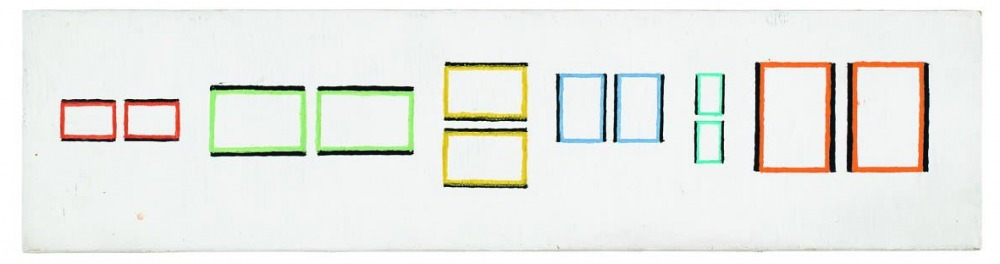

# Baer Keyboard

## Quick Start
### Where is the spacebar?
The nearest (first) row key either on the extreme right or the extreme left column serves as the spacebar.
### Where is the enter key?
The second row key either on the extreme right or the extreme left column acts as the enter key. Similarly, the third row key is the tab key and the fourth is destructive backspace.
### How do I type the red characters?
Hold down the second and third row keys on either side whilst tapping the key with the desired red character, for example question mark on the Q key.
### Where is the shift key?
Hold down the first row key, either left-most or right-most, whilst tapping one or more typing keys. This gives the upper-case letters and shifted key assignments.
## Concepts
Baer is an evolution of the Planck keyboard, a 12x4 _ortholinear_ layout (regular grid with all keys the same size and no row offsets). It can be built using the same hardware as Planck flashed with custom firmware.

For conceptual purposes, the 48 keys can be divided into two groups. The left-most and right-most columns are the _multifunction_, or **M** keys. The ten central columns are the _typing_, or **T** keys. The M-keys exhibit _bilateral symetry_ meaning that the left column or the right column may be used interchangeably. Starting with all the keys up, when you press and hold any M-key the keys in the column containing that key become the _primary_, or **P** keys and the keys in the opposite column become the _secondary_, or **S** keys. We number the rows from 1 being the nearest, so the spacebar is accessed by tapping (pressing and releasing) P1.

## Chords and Layers
Holding down a _chord_ of two or more P keys selects a _layer_ accessing a different set of key assignments for the T keys. There are three pre-defined layers and additional ones may be defined. The _QWERTY_ layer is mapped to P1+P2 and is the initial layer on power up. The _Overflow_ layer accesses the red characters mapped to P2+P3. The _numeric_ layer accessing the green characters is mapped to P3+P4.

A layer can be locked by holding down its chord and tapping S1, then the keys can all be released and the T keys will retain the mapping to that layer. To return to the QWERTY layer, hold down its assigned chord, P1+P2 and tap S1, then release all keys.

Clearly the three chords of two adjacent keys are the most readily accessed and should be assigned to the most used layers. But a total of fifteen layers are possible by assigning all combinations of the four keys. The single-key assignments (if any) are accessed by holding the key and one other, then releasing the other whilst continuing to hold the assigned key.

## Modifiers
Each of the M keys is also assigned to a _modifier_ _(shift_, _control_, _alt_ and _command_ or _windows_). This modifier is applied if the P key is held down whilst one or more T keys are tapped. For shift (P1) this functions as the usual shift key accessing upper case letters and punctuation. _Shift lock_ is set or released by holding P1 and tapping S1. _Escape_ is accessed by holding P1 while tapping S2, or S3 for _insert_, or S4 for _delete_.

This system only works for single modifiers and also it cannot apply the modifier alone, for example to modify mouse clicks. To cover these more complex needs, a second scheme is also implemented. First either P2 or P3 is held down, then any combination of S keys is held down, representing the desired modifier combination. Then the P key is released. At this point the modifiers are registered as active (key down is sent). Now any sequence of T key and/or P key and/or mouse key may be tapped. The P keys may also be tapped with the un-shifted character being used if the sequence was started with P2 or the shifted for P3. As the S keys are released the corresponding modifiers are reset (key up is sent).

For example, to type Ctrl+alt+del, hold P3+S2+S3, release P3, tap P4, release S2+S3.

As a side note, modifiers are the single exception to the bilateral symmetry rule. Left and Right M keys send different modifier messages to the computer and this may be taken into account for some macro key assignments. However for the most part, computers regard left and right modifier keys as synonymous.

## Arrows
There are two ways of typing the arrow navigation keys:

1. The WASD keys are assigned to arrows in the overflow layer according to the gaming convention. So hold down P2+P3 and tap W, A, S or D according to direction. Note that _page Up_, _Page Down_, _Home_ and _End_ are assigned to keys immediately to the right of this cluster on the overflow layer.
2. The navigation arrows are also assigned to the four S keys with the _cmd_ modifier, so hold down P4 whilst tapping S4 for up, S3 for right, S2 for left and S1 for down.

## Implementation
Baer Keyboard can be implemented using QMK Planck hardware and firmware or alternatively using Adafruit hardware and CircuitPython. The latter route is strongly recommended unless you wish to convert an existing Planck keyboard as QMK has a much more punishing learning curve.

### CircuitPython
The reference implementation was built using two Adafruit NeoKey 5x6 Ortho Snap-Apart circuit boards with one row snapped off each leaving 4x6 which were then soldered together side by side giving the 4x12 grid. An Adafruit Feather RP2040 boot-loaded with CircuitPython was used as the controller. Any other CircuitPython board could also be used given it has enough GPIO (14 + 1 for NeoPixels). This includes the Pico RP2040 if you are happy with micro-usb rather than USB-C (I was not!).

Driving the NeoPixels presents a problem for 3.3V controllers such as the RP2040. You might get away with powering the pixels from 3.3V if only a few are lit at once, but even this is outside the specification. I modified the Feather to tap off the 5V USB supply before the voltage regulator to power the NeoPixels and used a 74LV1T86 chip to boost the GPIO signal pin from 3.3V to 5V. This worked well, but it is still necessary to limit the number and brightness of pixels lit simultaneously to keep the current consumption within USB limits.

### QMK
You will need to clone 'qmk_firmware' from githib and follow the instructions to set up a build environment. Add the 'qmk/baer' folder from this repository to the 'keyboards/planck/keymaps/' folder in QMK. Now build the planck keyboard with the baer keymap and bootload to a Planck circuit board.